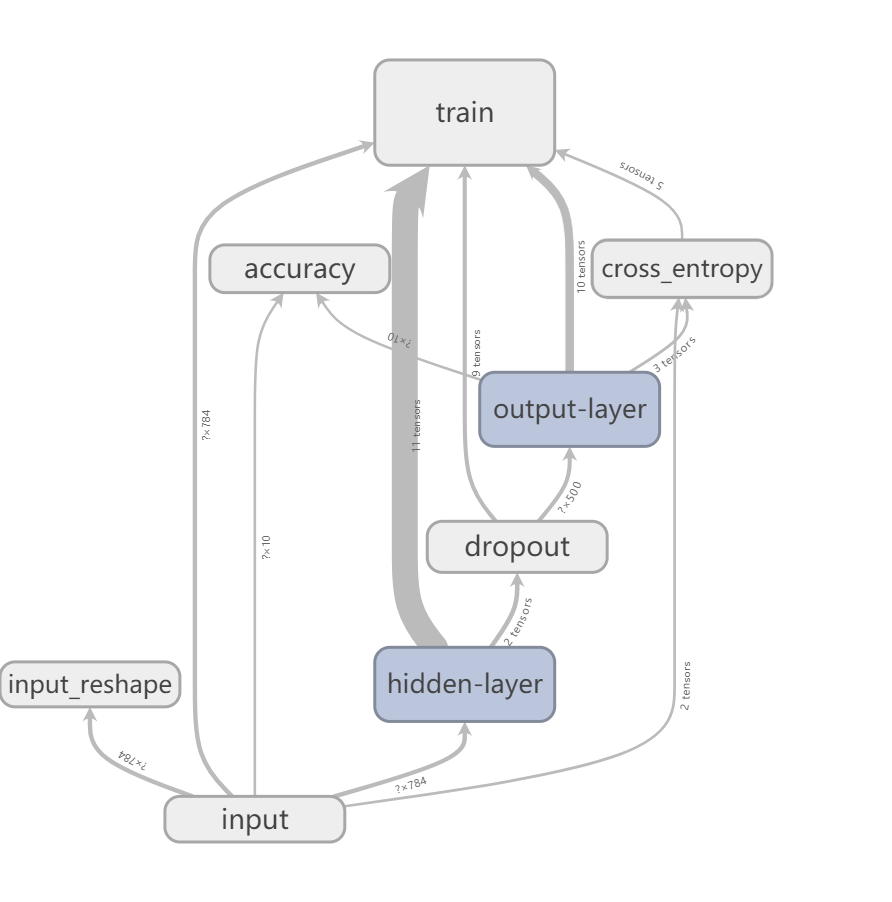

# 学习使用 Tensorboard

## 环境配置

```
virtualenv --no-site-packages --python=python3.5 venv
source venv/bin/activate
pip install numpy pandas matplotlib tensorflow=1.4.1
deactivate
```

## 运行样例

```
source venv/bin/activate
python3 tensorboard_sample.py
deactivate
cd tmp/logs/mnist_with_summaries
tensorboard --logdir="./"
```

## 网络结构图



## with name_scope(scope_name)

我们通常都用 with name_scope(scope_name) 来限定命名空间，这样可以使得网络的结构图更加清晰，并且在这个命名空间下的所有的节点都会被自动命名成 scope_name/xxx 的格式。

## tf.summary.scalar()

[官方 api](https://www.tensorflow.org/api_docs/python/tf/summary/scalar)

```
tf.summary.scalar(
    name,
    tensor,
    collections=None,
    family=None
)
```

用于汇总标量数据。

## tf.summary.image()

[官方 api](https://www.tensorflow.org/api_docs/python/tf/summary/image)

```
tf.summary.image(
    name,
    tensor,
    max_outputs=3,
    collections=None,
    family=None
)
```

tensor 必须是 4 维的，形状为 [batch_size, height, width, channels]，max_outputs 是生成图片的最大的数目。可以用这个 api 对图像进行预览工作。

## tf.summary.histogram()

[官方 api](https://www.tensorflow.org/api_docs/python/tf/summary/histogram)

```
tf.summary.histogram(
    name,
    values,
    collections=None,
    family=None
)
```

当你想查看一个tensor在训练过程的值的分布情况时，可以借助这个 api 达到目的，values 可以是任意形状的 tensor，生成 tensor 对应的直方图。Tensorboard有两个选项卡查看histogram的结果：HISTOGRAMS和DISTRIBUTIONS， 前者以直方形式显示统计结果， 后者提供更为抽象的统计信息。
直方图有两种显示模式：OVERLAY 和 OFFSET。

### OVERLAY
横轴为值，纵轴为数量，不同的线代表不同的 step，如果较晚的线与较早的线重合，那么就以覆盖的方式画线。将鼠标停留在一个点上，会加黑显示三个数字，含义是：在step xxx 时，有 xxx 个元素的值（约等于）xxx。

### OFFSET
横轴为值，纵轴为 step，数量要将鼠标停在图片上才会显示。


## tf.summary.FileWriter

[官方 api](https://www.tensorflow.org/api_docs/python/tf/summary/FileWriter)

```
__init__(
    logdir,
    graph=None,
    max_queue=10,
    flush_secs=120,
    graph_def=None,
    filename_suffix=None
)
```

- FileWriter：文件记录器，我们可以定义多个文件记录器，logdir 为 FileWriter（文件记录器）对应的路径，FileWriter 将把数据写到这里。
- graph：计算图，初始化 FileWriter 的时候可以传入一个计算图，这样在 TensorBoard 的 GRAPHS 窗口就能展示整个计算图的可视化效果图了。

## tf.summary.merge_all()

[官方 api](https://www.tensorflow.org/api_docs/python/tf/summary/merge_all)

我们之前定义了很多汇总操作，逐一操作的话太麻烦，可以用 tf.summary.merge_all() 来整合所有的汇总操作。

## tf.train.Saver

[官方 api](https://www.tensorflow.org/api_docs/python/tf/train/Saver)

```
__init__(
    var_list=None,
    reshape=False,
    sharded=False,
    max_to_keep=5,
    keep_checkpoint_every_n_hours=10000.0,
    name=None,
    restore_sequentially=False,
    saver_def=None,
    builder=None,
    defer_build=False,
    allow_empty=False,
    write_version=tf.train.SaverDef.V2,
    pad_step_number=False,
    save_relative_paths=False,
    filename=None
)
```

- max_to_keep：the maximum number of recent checkpoint files to keep.
- keep_checkpoint_every_n_hours=2：如果这样设置的话可以保证每训练两个小时就保存一次模型

## tf.train.Saver.save()

[官方 api](https://www.tensorflow.org/api_docs/python/tf/train/Saver#save)

```
save(
    sess,
    save_path,
    global_step=None,
    latest_filename=None,
    meta_graph_suffix='meta',
    write_meta_graph=True,
    write_state=True,
    strip_default_attrs=False
)
```

该方法就是用来保存模型的，其实就是保存模型中的变量（Variable 对象）。
- save_path: String. Prefix of filenames created for the checkpoint.
- global_step: If provided the global step number is appended to save_path to create the checkpoint filenames. The optional argument can be a Tensor, a Tensor name or an integer.

## 模型的保存/重载
[参考文档](https://blog.csdn.net/Jerr__y/article/details/78594494)

